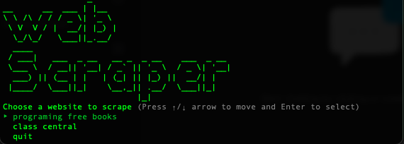

# web-scraper-ruby

CLI web scraper with user friendly interface, that allows users to scrap web pages for data and export it.

## Screenshot



## Built With

- Ruby

## Getting Started

First ensure that you have ruby installed on your local machine. and follow steps to run program

## Prequisites

Ruby installed on your local machine. Terminal or similar to execute the program.

### Gem libraries used

- nokogiri
- tty-prompt
- open-uri
- ruby_figlet
- 'pry'

To install those libraries, simply run ```gem install [gem-name]```

## Install

- clone project by running ``git clone https://github.com/juxsalley/web-scraper-ruby.git``
  
- ``cd web-scraper-ruby``
- install required gems ```bundle install```


## Usage

- cd into project by ``cd web-scraper-ruby``
- Execute in terminal like so ```scraper``` 

## Author

👤 Iddrisu salley

- GitHub: [iddrisu salley](https://github.com/juxsalley)
- Twitter: [__salley](https://twitter.com/__salley)

## 🤝 Contributing

Contributions, issues, and feature requests are welcome!

Feel free to check the [issues page](https://github.com/sergiocortessat/RubyCapstone/issues).

## Show your support

Give a ⭐️ if you like this project!

## 📝 License

This project is [MIT](LICENSE) licensed.